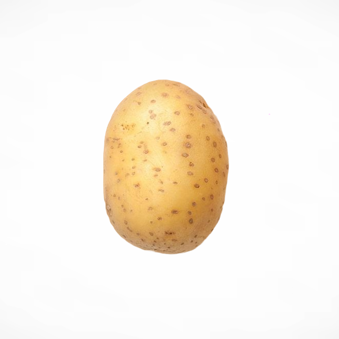

<p align="center">
  
</p>

<h1 align="center">PantryVeda</h1>
<p align="center">Scan your groceries, stop wasting food, and let your kitchen plan itself.</p>

<p align="center">
  
  
  
  
</p>

<p align="center">
  <a href="https://drive.google.com/file/d/10CRI6RKe1NV2qWw1RVGkhw1UBCOx4lDa/view?usp=sharing">
    
  </a>
</p>

---

## What it does

PantryVeda is a smart kitchen assistant that runs entirely in the browser. Point your camera at your groceries, and it tells you what you just bought, tracks it until it's about to go bad, and uses that history to get better at telling you what to buy next time.

- 📷 **Scan groceries** — point your camera or upload a photo; a YOLO object-detection model identifies produce in real time, right in the browser
- ⏳ **Expiry tracking** — every item in your pantry is tracked from purchase to expiry, with at-a-glance status for what's fresh, what's expiring soon, and what's already gone
- 🍳 **Recipe suggestions** — 25+ built-in recipes, matched and filtered by what's actually in your pantry and what's about to expire
- 🛒 **Smart shopping list** — a personalized model learns from *your* consumption and waste history to suggest what to buy and how much
- 🗓️ **Meal planning** — drag and drop recipes onto a weekly planner; planned meals feed forward into what the shopping list thinks you'll need
- 📊 **Analytics dashboard** — trends, category breakdowns, and the running cost of what you've used versus what you've thrown away

## How the scanner works

<p align="center">
  
  
</p>

The scanner runs a YOLO object-detection model — converted to [TensorFlow.js](https://www.tensorflow.org/js) — directly in your browser. No image is sent to a server just to figure out what's on your counter:

1. A frame is captured from your camera (via `webcam-easy`) or uploaded as a photo
2. It's padded to square, resized to 320×320, and normalized before inference
3. The TF.js model runs inference client-side and returns detections across **58 produce classes**
4. Raw model labels (e.g. `Fuji_Apple`, `Granny_smith_apple`) are mapped and consolidated to a clean, master ingredient list (e.g. `Apple`) of **101 tracked ingredients**
5. If nothing is detected, or a detected label can't be matched to a known ingredient, the frame is uploaded to Cloudinary for review instead of silently failing

## How the shopping list learns

Every pantry is different, so PantryVeda doesn't ship one static set of rules — it trains a small model *per user*, on-device:

- A lightweight neural network (TensorFlow.js, `Dense` layers) is trained on your own consumption and waste logs and saved to your browser's IndexedDB — nothing leaves your machine
- It predicts how much of each ingredient you'll need next, and compares that against what's already in stock
- New users (or anyone without enough history yet) fall back to a heuristic suggestion engine until there's enough data to train on
- Planned meals from the meal planner are factored in too, so upcoming recipes bump up what the list recommends

## Tech stack

| Layer | Tech |
|---|---|
| Framework | Next.js 14 (App Router), React 18, TypeScript |
| State | Zustand (persisted to IndexedDB / localStorage) |
| ML / CV | TensorFlow.js — YOLO object detection + a custom per-user prediction model |
| Styling / UI | Tailwind CSS, Framer Motion, lucide-react |
| Drag & drop | @dnd-kit |
| Charts | Recharts |
| Media | webcam-easy, Cloudinary (`next-cloudinary`) |
| Dates | date-fns |

## Getting started

**Requirements:** Node.js 18.17+ and npm (or yarn/pnpm/bun)

```bash
# 1. Clone the repo
git clone https://github.com/<your-username>/PantryVedaProject.git
cd PantryVedaProject

# 2. Install dependencies
npm install

# 3. Set up environment variables (see below)
touch .env.local   # then add the variable described below

# 4. Run the dev server
npm run dev
```

Open [http://localhost:3000](http://localhost:3000) to see it running.

### Environment variables

PantryVeda uses [Cloudinary](https://cloudinary.com) to store images from failed scans. Create a free Cloudinary account, then add this to `.env.local`:

```env
NEXT_PUBLIC_CLOUDINARY_CLOUD_NAME=your_cloud_name
```

You'll also need an **unsigned upload preset** named `pantryveda_preset` in your Cloudinary dashboard (Settings → Upload → Upload presets) for client-side uploads to work.

## Project structure

```
src/
├── app/                # Next.js App Router pages (dashboard, scanner, inventory,
│                        recipes, meal-plan, shopping, analytics)
├── components/         # UI components, grouped by feature area
├── lib/                # Core logic — YOLO/ML services, suggestion engine,
│                        recipe matching, analytics, meal-plan logic
├── store/              # Zustand store (pantry state, persisted)
├── data/               # Built-in ingredient & recipe databases
└── types/              # Shared TypeScript types
public/
├── model/               # TensorFlow.js YOLO model (converted from ONNX)
└── images/              # App illustrations & recipe images
```

## Roadmap

- [ ] Automated tests around the suggestion engine and label mapping
- [ ] Multi-user accounts (currently a single local pantry per browser)
- [ ] Expand the detection model beyond produce (pantry staples, dairy, etc.)

## License

This project is licensed under the [MIT License](LICENSE).
